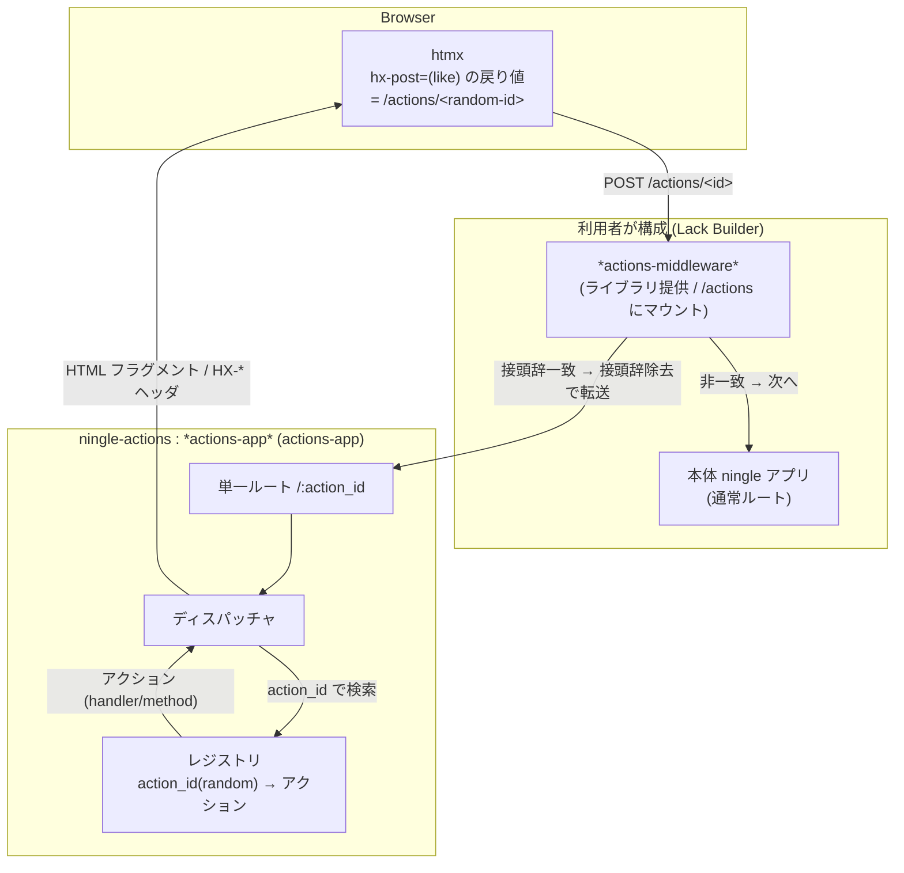
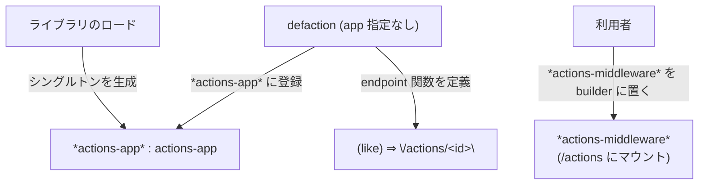
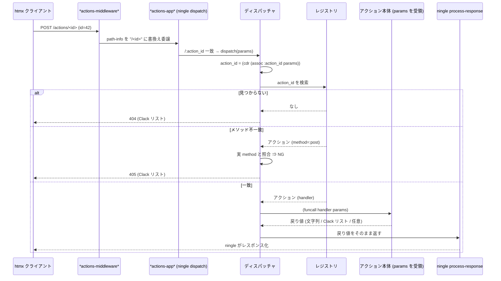
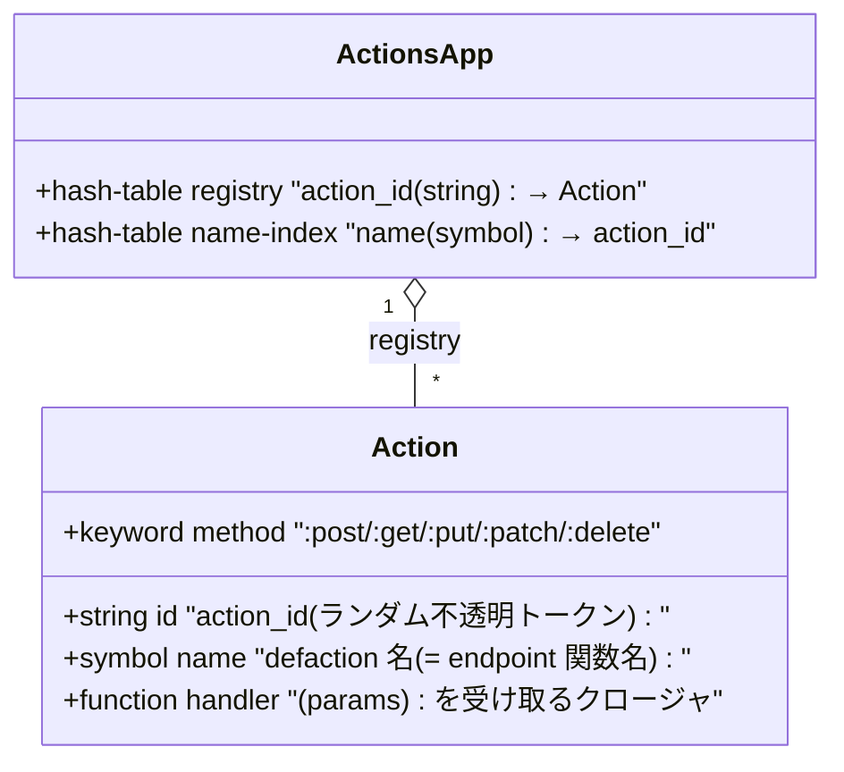
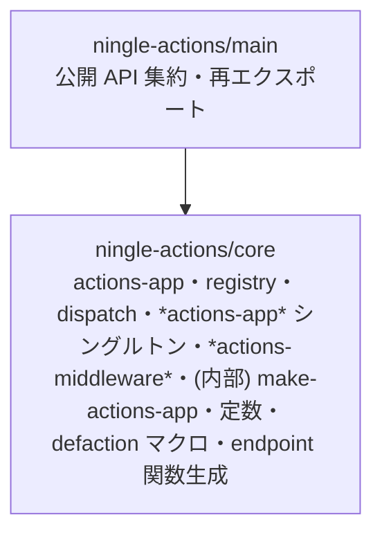
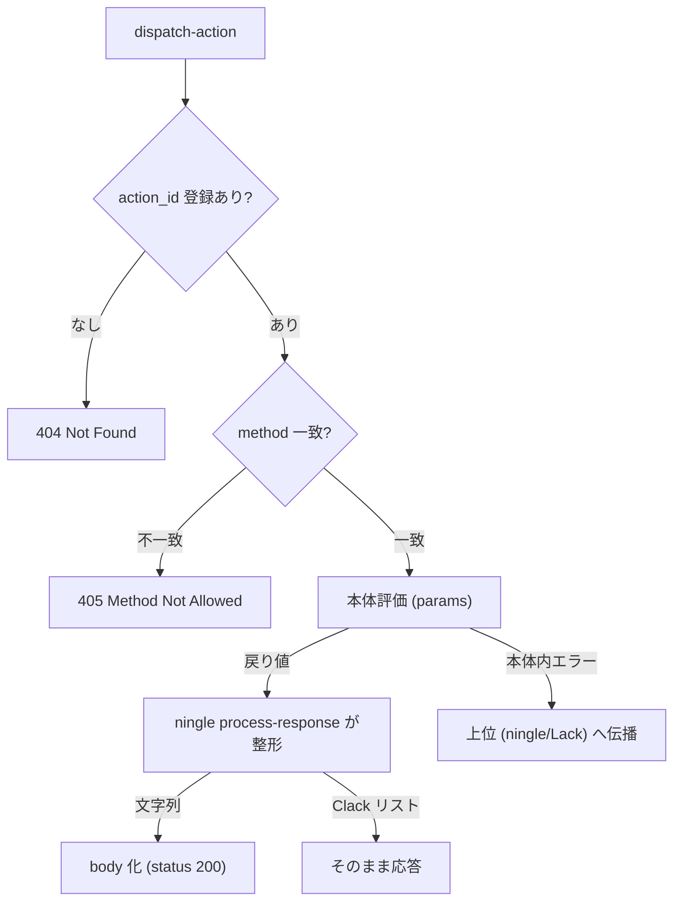

# 機能設計書 (Functional Design)

本書は `ningle-actions` の機能ごとのアーキテクチャ・データモデル・コンポーネント設計・API 設計を定義する。
要求の出典は [product-requirements.md](./product-requirements.md)。

---

## 0. 設計の中核コンセプト

利用者が **具体的な URL を一切意識せずに** サーバーアクションを定義・参照できることを最重要原則とする。

- アクションアプリは **単一の動的エンドポイント `/:action_id`**（本体から見ると `/actions/:action_id`）だけを公開する。
- 各アクションは **ランダムな不透明トークン `action_id`** でレジストリに登録され、URL 中の `action_id` で対応ハンドラへディスパッチされる。
- `defaction` は次の 2 つを同時に行う:
  1. ハンドラを **レジストリへ登録**（`action_id` → アクション）。
  2. **エンドポイント URL を返す関数を定義**（利用者はこの関数の戻り値を htmx 属性に埋め込む）。
- アクションの登録先は **ライブラリが提供するシングルトンのアクションアプリ `*actions-app*`**。`defaction` はこれを暗黙に使い、**利用者はアプリインスタンスを生成・保持しない**（ライブラリが用意したものをそのまま使う）。
- アクション本体は **ningle と同じく `params`（alist）をそのまま受け取る**。型強制・引数バリデーションは行わない（利用者の責務）。
- アクション本体の **戻り値も ningle の `process-response` がそのまま処理する**。レスポンス整形・content-type 設定・シリアライズはライブラリでは行わない（利用者／ningle の責務）。
- 接頭辞は **`/actions` 固定**。アクションアプリ `*actions-app*` はライブラリがロード時に生成するシングルトンで、**マウントは `*actions-middleware*` を `lack:builder` のチェインに置くだけ**で行える（接頭辞 `/actions` は内包）。

これにより、利用者はルートパスを設計・記憶する必要がなくなり、アクションは「名前で呼ぶ関数」として扱える（Next.js Server Actions の発想）。一方でリクエスト値の扱いは ningle の流儀を崩さない。

---

## 1. システム構成

### 1.1 全体像



- `*actions-middleware*`（利用者が builder に置く、ライブラリ提供の mount ミドルウェア）は `path-info` が `/actions` に一致すると接頭辞を除去してアクションアプリへ委譲する（`/actions/<id>` → アクションアプリには `/<id>` として届く）。
- アクションアプリは `/:action_id` ルートひとつだけを持ち、`action_id` をレジストリで引いてハンドラを呼ぶ。

### 1.2 シングルトンアプリと利用フロー



- `*actions-app*`（`ningle-actions:*actions-app*`）はライブラリが提供するシングルトンのアクションアプリ。ロード時に単一ルート登録済みのインスタンスとして確定する。
- 利用者はインスタンスを生成・保持しない。`*actions-app*` をそのまま `defaction` の登録先として使い、マウントは `*actions-middleware*` を builder に置くだけでよい。
- `defaction` は `*actions-app*` に登録する。
- 内部コンストラクタ `make-actions-app`（非公開）は副作用のない純粋関数で、シングルトンの生成とテスト時の隔離インスタンス生成に用いる。

### 1.3 接頭辞（prefix）の扱い

接頭辞は **`/actions` 固定**（定数）。mount ミドルウェアは `path-info` を書き換えるが `script-name` は更新しない（実装で確認済み）ため接頭辞を実行時に取得できないが、固定値なのでエンドポイント生成関数は定数を前置するだけでよい。

> 契約: マウントは **`/actions` 固定**（エンドポイント関数の返す URL と一致させるため）。ライブラリ提供の `*actions-middleware*` がこの接頭辞を内包するので、利用者は builder に置くだけで接頭辞ずれが起きない。

---

## 2. リクエストライフサイクル



ディスパッチャは戻り値を加工せずそのまま返し、**整形は ningle の `process-response` に委ねる**:
- ハンドラが **文字列**を返すと `*response*` の body に設定され finalize される（content-type 等は `*response*` の状態に依存。既定では未設定）。
- ハンドラが **Clack 形式リスト** `(status headers body)` を返すとそのまま通る（404/405 応答や任意ステータスに利用）。
- content-type を `text/html` 等にしたい場合は、利用者が本体内で `*response*` を操作する（ライブラリは関与しない）。

> `params` はディスパッチャが ningle から受け取った alist をそのまま渡す。フォーム/クエリ値は文字列キー（`"id"`）、ルートパラメータ `:action_id` はキーワードキーで含まれる（ningle の流儀に一致）。

---

## 3. データモデル

`ningle-actions` は永続データストアを持たない。中核は「アクション」とそのレジストリ。

### 3.1 アクションアプリ・アクション



- `ActionsApp` は `ningle:app` の派生（mount 可能）。設定スロットは持たず、接頭辞・content-type は定数。
- アクション本体は引数仕様を持たない。`params` をそのまま受け取る。

### 3.2 action_id の生成と再定義

- `action_id` は `lack/util:generate-random-id`（ironclad による hex トークン）で **ランダム生成**する。推測不能で URL セーフ。
- 利用者は `action_id` を直接書かず、`defaction` が定義する関数経由でのみ URL を取得するため、不透明な値で支障ない。
- **再定義(re-eval)時の安定性**: `name-index`（`name` → `action_id`）を持ち、同名アクションを再定義した場合は **既存の `action_id` を再利用**してハンドラ／メソッドのみ差し替える。これにより開発中の再評価で URL が変わらない。

---

## 4. コンポーネント設計

`package-inferred-system` に従い、関心ごとにファイル＝パッケージを分割する（最終確定は [repository-structure.md](./repository-structure.md)）。型強制・バリデーション・htmx ヘルパを持たないため構成は最小。



### 4.1 `core`（actions-app / registry / dispatch / グローバル）
- 定数: `+actions-prefix+` = `"/actions"`。
- `actions-app` クラス（`ningle:app` 継承）。スロット: `registry` / `name-index`。
- `make-actions-app ()`（**内部・非公開**）:
  - `actions-app` を生成し、**生成時に単一ルートを全標準メソッドで登録**:
    ```lisp
    (setf (ningle:route app "/:action_id"
                        :method '(:GET :POST :PUT :PATCH :DELETE))
          (lambda (params) (dispatch-action app params)))
    ```
  - **副作用を持たず**、生成したインスタンスを返すだけ。
- `*actions-app*` : ライブラリが提供するシングルトンのアクションアプリ（特殊変数）。ロード時に `(make-actions-app)` の戻り値で確定する（`defvar`。再評価時も既存インスタンスと登録済みアクションを保持）。`defaction` の暗黙の登録先。
- `*actions-middleware*` : `*actions-app*` を固定 prefix `/actions` でマウントする Lack ミドルウェア（`(lambda (app) (funcall *lack-middleware-mount* app "/actions" *actions-app*))`）。利用者は `lack:builder` のチェインにこれを置くだけでアクションアプリを組み込める。
- `register-action (app name method handler)`:
  - `name-index` を引き、既存があればその `action_id` を再利用、なければ `generate-random-id` で採番。
  - レジストリへ `Action` を登録し、`action_id` を返す。
- `find-action (app id)`。
- `action-endpoint (id &optional query)`：`/actions/<id>` を組み立てて返す。`query`（キーワード/値の plist）が与えられた場合は `quri:make-uri` / `quri:render-uri` で URL エンコード済みのクエリ文字列を付加する（`(action-endpoint id '(:category "foo" :page 2))` → `/actions/<id>?category=foo&page=2`）。`query` が `nil` のときは従来どおり `/actions/<id>` を返す。キーはキーワード名の小文字文字列、値は `princ-to-string` で文字列化する。
- `dispatch-action (app params)`:
  1. `action_id` を `(cdr (assoc :action_id params))` で取得。
  2. レジストリ検索。なければ `(404 () ("Not Found"))`。
  3. 実リクエストメソッド（`request-method *request*`）とアクションの `method` を照合。不一致なら `(405 () ("Method Not Allowed"))`。
  4. 一致すれば `(funcall (action-handler action) params)` の戻り値を**そのまま返す**（整形は ningle に委ねる）。

### 4.2 `defaction` / endpoint 関数生成
- `defaction` マクロ（API は §5）。展開で:
  1. 本体を `(lambda (params) ...)` にまとめる。
  2. `register-action` で `*actions-app*` へ登録し `action_id` を確定（再定義時は再利用）。
  3. `action_id` から完全エンドポイント（`/actions/<id>`）を返す関数 `name` を `defun`。この関数は `&rest` でキーワード引数を受け取り、`action-endpoint` に渡してクエリパラメータ付き URL を組み立てる。

### 4.3 htmx レスポンス制御について（ライブラリ対象外）

`HX-*` レスポンスヘッダ（`HX-Trigger` / `HX-Redirect` 等）の制御は **本ライブラリの対象外**とする。これらは ningle 標準の `*response*` ヘッダ操作でそのまま記述できるため、コアには糖衣を持ち込まない。

```lisp
(defaction like :post (params)
  ;; HX-* もningle標準のヘッダ操作で設定できる
  (setf (getf (lack/response:response-headers ningle:*response*) :|HX-Trigger|) "likeAdded")
  (render-like-button ...))
```

将来的に需要があれば、別パッケージ（例: `ningle-actions-htmx`）として糖衣関数を提供する余地を残す。

---

## 5. API 設計

### 5.1 `defaction`（中核マクロ）

```lisp
(defaction NAME METHOD (PARAMS) &body BODY)
```

- `NAME` : シンボル。**この名前の関数が定義され、呼ぶとエンドポイント URL 文字列を返す**。アクションのレジストリ名でもある。キーワード引数を渡すと、そのキー・値が URL エンコードされてクエリパラメータとして付加される（`(NAME :category "foo" :page 2)` → `/actions/<id>?category=foo&page=2`）。
- `METHOD` : HTTP メソッドキーワード（位置引数）。`:post` `:get` `:put` `:patch` `:delete`。
- `(PARAMS)` : 本体で束縛するパラメータ変数名を 1 つ持つリスト。`BODY` 内でこの名前により ningle の `params`（alist）を参照する。
- `BODY` : `PARAMS` が束縛された状態で評価。`ningle:*request*` `*response*` `*session*` `*context*` も参照可能。

登録先は常にシングルトン `*actions-app*`。利用者はインスタンスを生成しない。

#### 利用例

```lisp
;; 生成は不要。defaction はシングルトン *actions-app* に登録する。
(defaction like :post (params)
  (let ((id (parse-integer (cdr (assoc "id" params :test #'string=)))))
    (incf (gethash id *likes* 0))
    (render-like-button id)))                 ; HTML フラグメントを返す

;; ↓ defaction が定義した関数。URL を意識せず参照できる
(like)  ;=> "/actions/3f9a...c2"   (ランダム id)

;; キーワード引数はクエリパラメータとして付加される
(like :id 42)  ;=> "/actions/3f9a...c2?id=42"
```

統合（`*actions-middleware*` を builder に置くだけ）:
```lisp
(defparameter *web-app*
  (lack:builder
    *actions-middleware*
    *web*))
```

ビュー側（生成手段は自由）— `(like)` の戻り値文字列をテンプレートへ埋め込む:
```html
<button hx-post="…(like) の値…" hx-target="#like-42">いいね</button>
```

#### 展開イメージ（概念）

```lisp
(progn
  (let ((#1=#:id (register-action *actions-app* 'like :post
                                  (lambda (params)
                                    (let ((id (parse-integer
                                               (cdr (assoc "id" params :test #'string=)))))
                                      (incf (gethash id *likes* 0))
                                      (render-like-button id))))))
    (defun like (&rest query) (action-endpoint #1# query))))
```

### 5.2 `*actions-app*`

```lisp
*actions-app*
  ;; => actions-app（単一ルート /:action_id 登録済み）のシングルトン。
  ;;    ロード時に確定。defaction の登録先。マウントは *actions-middleware* 経由。
```

### 5.2.1 `*actions-middleware*`

```lisp
*actions-middleware*
  ;; => (lambda (app) (funcall *lack-middleware-mount* app "/actions" *actions-app*))
  ;;    *actions-app* を固定接頭辞 /actions でマウントする Lack ミドルウェア。
  ;;    利用者は lack:builder のチェインに置くだけでよい。
```

### 5.3 公開シンボル（`ningle-actions` パッケージ）

| シンボル | 種別 | 概要 |
|----------|------|------|
| `defaction` | マクロ | アクション登録 + エンドポイント関数定義 |
| `*actions-middleware*` | 変数 | `*actions-app*` を `/actions` にマウントする Lack ミドルウェア |
| `*actions-app*` | 変数 | シングルトンのアクションアプリ。`defaction` の登録先 |
| `actions-app` | クラス | アクションアプリ型 |

> `make-actions-app` は内部コンストラクタとし公開しない（シングルトン生成・テストの隔離インスタンス生成に用いる）。

> `action-endpoint`（`(id &optional query)` → 完全 URL）は内部ヘルパとし公開しない。`action_id` は不透明な内部値で利用者は保持せず、URL は `defaction` が定義する同名関数経由でのみ取得する。
> マウントは `*actions-middleware*` のみを提供する（接頭辞 `/actions` 固定の薄いラッパ）。htmx ヘルパ・型強制/バリデーション API は提供しない（HX-* と `params` は ningle 標準のまま扱う）。

---

## 6. エラー処理フロー



- ディスパッチ段の 404 / 405 のみライブラリが応答する。
- レスポンス整形は ningle に委譲（ライブラリは戻り値を加工しない）。
- 入力検証・型変換は本体（利用者コード）の責務。本体内エラーは握りつぶさず上位へ委ねる（NFR4・デバッグ容易性）。

---

## 7. 画面・UI

本ライブラリは UI を持たない（ビュー層非依存）。利用例として htmx と組み合わせた最小フォームを README / サンプルで示す（NFR7）。アクションが返す HTML フラグメントの生成手段（文字列・Spinneret・cl-who 等）は利用者の自由とする。
